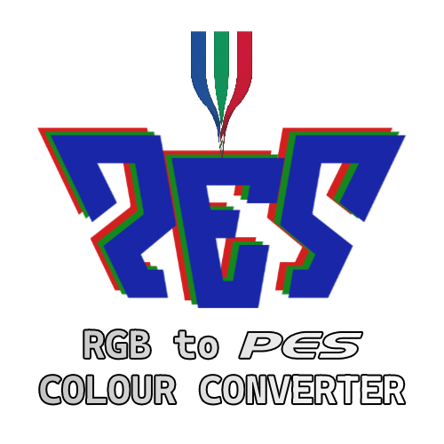
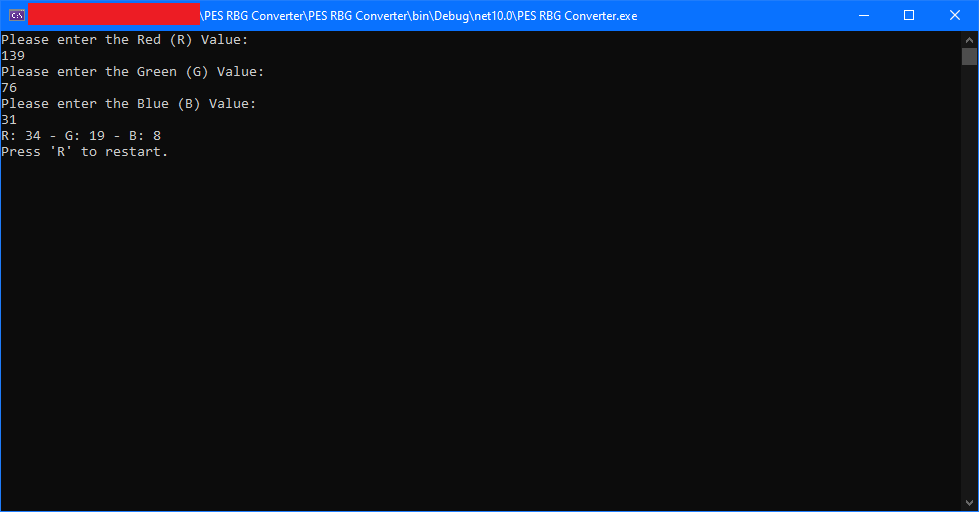

  

# RGB to PES Converter

A lightweight C# console tool for converting RGB colour values (0–255) to Pro Evolution Soccer (PES) format (0–63).

---

## Demo

---

## Features

- Accepts R, G, B values individually via console input
- Validates input — only whole numbers between 0 and 255 are accepted
- Accurate proportional conversion using `Math.Round` with midpoint rounding
- Press `R` to restart without relaunching the application

---

## Requirements

- Windows 64-bit OS
- No .NET installation required (self-contained)

---

## Usage

1. Run `RGB to PES Converter.exe`
2. Enter the **Red** value (0–255) when prompted
3. Enter the **Green** value (0–255) when prompted
4. Enter the **Blue** value (0–255) when prompted
5. The converted PES values will be displayed as `R: x - G: x - B: x`
6. Press `R` to restart or any other key to exit

---

## Conversion Formula

`pesValue = Round(rgbValue × 63 / 255)`

Maps the full 0–255 RGB range proportionally to the 0–63 PES range,
with midpoint values (.5) rounding away from zero.

---

## License

This project is licensed under the
[CC BY-ND 4.0](https://creativecommons.org/licenses/by-nd/4.0/) license.

You are free to **use** and **redistribute** this application **as-is**.
You may **not** modify, adapt, or build upon it.
**Attribution to the original author must be preserved at all times.**

© 2026 Paraskevas D. All rights reserved.
